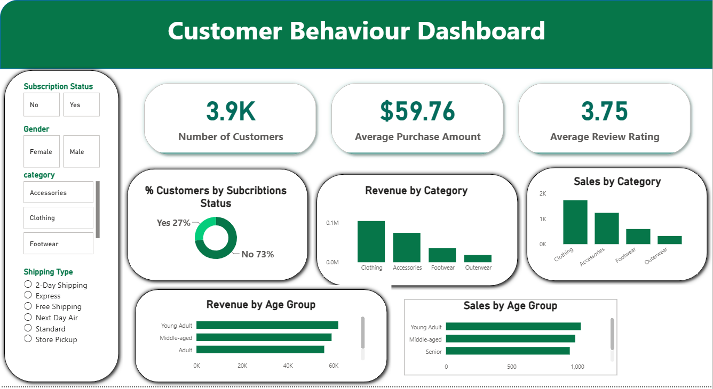

# analyse-comportement-clients
Analyse de bout en bout des tendances d'achat et du comportement des clients  en utilisant SQL  et Power BI.

*(Projet Data Analytics – Python, SQL, Power BI)*

##  **1. Présentation du projet**

Ce projet analyse le comportement d’achat des clients à partir d’un ensemble de données transactionnelles comprenant **3 900 achats**.
L’objectif principal est d’identifier les tendances, les segments de clients, les produits performants et les facteurs influençant la fidélité et l’abonnement, afin de soutenir la prise de décision stratégique.

---

##  **2. Objectifs du projet**

* Comprendre les modèles de dépense selon différents segments clients.
* Identifier les produits les plus performants et les catégories clés.
* Analyser l’impact des remises, des avis et des modes de livraison.
* Étudier la relation entre achats répétés et abonnement.
* Fournir des recommandations business actionnables.

---

##  **3. Préparation & Exploration des Données (Python)**

* Chargement et exploration initiale (`pandas`, `df.info()`, `df.describe()`)
* Gestion des valeurs manquantes (imputation par médiane par catégorie)
* Standardisation des colonnes (format *snake_case*)
* Feature engineering :

  * `age_group`
  * `purchase_frequency_days`
* Vérification de la cohérence des données
* Intégration dans une base MySQL pour l’analyse SQL

---

##  **4. Analyse SQL (Transactions commerciales)**

Les analyses ont été réalisées dans **MySQL** pour répondre à plusieurs questions stratégiques :

* Chiffre d’affaires par sexe
* Clients dépensant beaucoup avec remises
* Top 5 des produits les mieux notés
* Comparaison des modes de livraison (Standard vs Express)
* Abonnés vs non abonnés
* Produits avec le plus haut taux d’achats remisés
* Segmentation : Nouveaux, Récurrents, Fidèles
* Top 3 produits par catégorie
* Achat répété + probabilité d’abonnement
* Revenus par tranche d’âge

---

##  **5. Tableau de bord Power BI**
  
  
  

---

##  **6. Recommandations Business**

* **Augmenter les abonnements** via des avantages exclusifs
* **Programmes de fidélité** pour encourager les achats récurrents
* **Optimisation des remises** afin de préserver les marges
* **Mise en avant des produits performants** dans les campagnes
* **Marketing ciblé** sur les tranches d’âge à fort revenu et les utilisateurs Express

---

##  **7. Technologies utilisées**

* **Python** : Pandas
* **SQL** : MySQL
* **Data Visualization** : Power BI

---

##  **8. Rapport du projet**

[Le rapport complet au format PDF est disponible ici :](Comportement_Client_Rapport.pdf)

